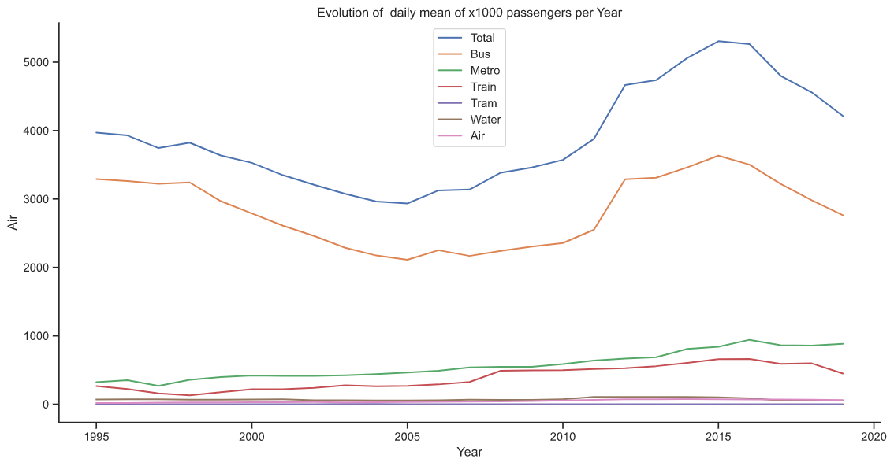

# Projects
Here I showcase my data science projects

**Competition - Notas ENEM (Grades ENEM)**

This competition was promoted by CodeNation.dev, It is a training program for technology professionals. For 10 weeks, developers and data scientists have access to challenges and content to acquire and practice the technical skills most used by technology companies around the world.

The data provived was of the ENEM 2016, the standardized Brazilian national exam, which evaluates high school students in Brazil. The objective of the competition was to predict the grades of the math exam. In this competition my model reached a score of 93.72%.

**Data Insights - Transporte RJ (Transportation RJ)**

This is a brief study about the Public Transportation of the city of Rio de Janeiro in the period of 1995-2019.

The data for this study was obtained at data.rio, a govermental transparency portal of the city of Rio de Janeiro.

